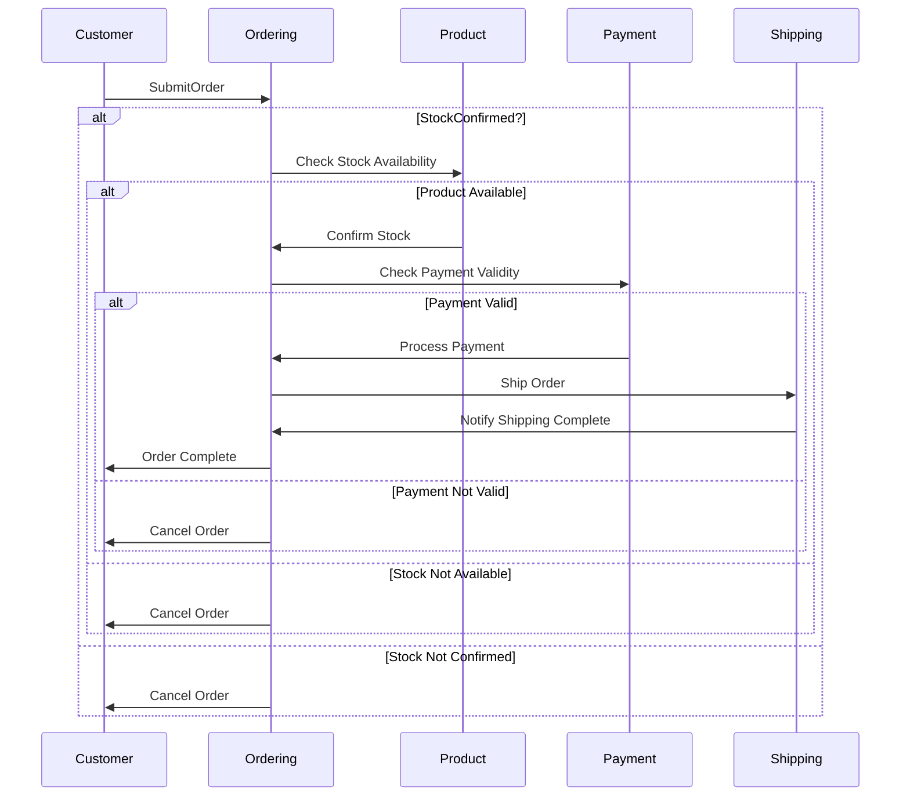
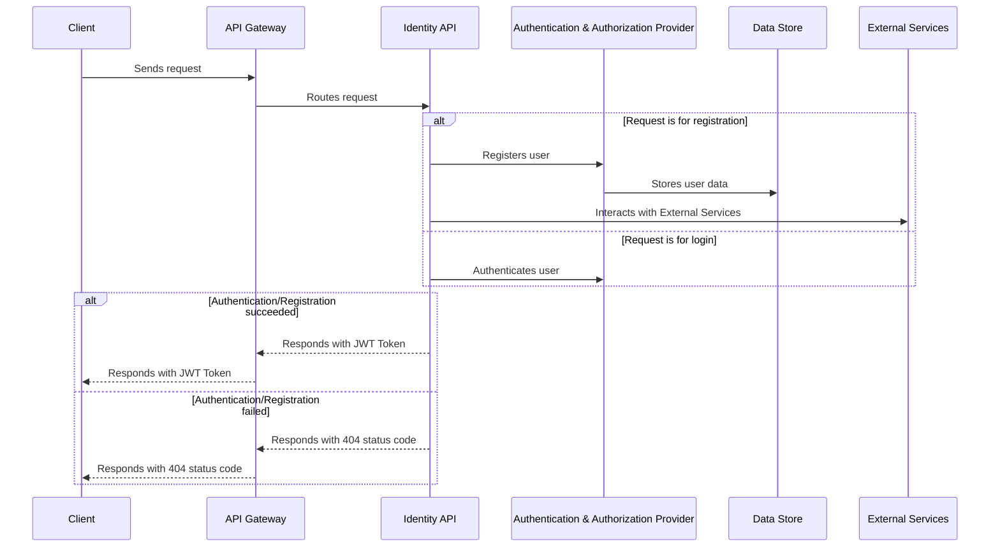
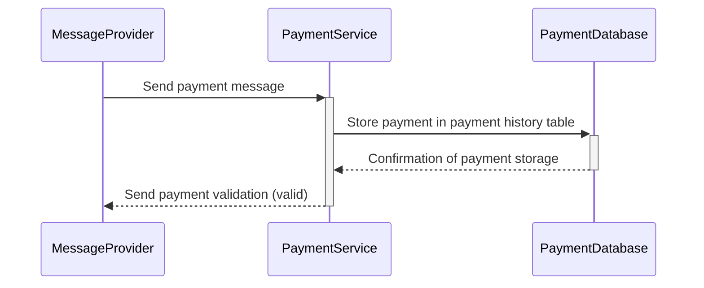

# CoffeeSpace
[](https://github.com/Marsik424/CoffeeSpace/actions/workflows/code_quality.yml) [](https://github.com/Marsik424/CoffeeSpace/actions/workflows/build.yml)

MAUI client with simple coffee ordering system
## Client Implementation

**Please note that the client part of this project is currently in active development.**

During the active development stage, I will integrate MAUI (Multi-platform App UI) into the client library to simplify integration with the web API. This integration will enable seamless dependency injection and provide cross-platform functionality for the client library.

## API Overview 

In this section, you will mainly see how the web API was implemented, which features and architecture design were used.

As you might have seen, Coffeespace uses a microservices approach to respond to client requests.

|      API       |    Libraries     |   Services     |
| :------------: |  :-----------:   |  :-----------: |    
|  OrderingAPI   |       Core       | PaymentService |
|  ProductsAPI   |     Messages     | ShipmentService|
|  IdentityAPI   |      Domain      |


**All APIs are using event-driven architecture with the CQRS pattern.
For the message provider, RabbitMQ was chosen as the message provider, with MassTransit as the message library.**

**To create messaging through MassTransit, all message models were moved to the Coffeespace.Messages project.**

Lets start with services, that some microservices can use. 

Service registration is implemented using the Scrutor library, which gives a great opportunity to add your services using reflection, as shown below.

```cs
 public static IServiceCollection AddApplicationService<TInterface>(
        this IServiceCollection services,
        ServiceLifetime serviceLifetime = ServiceLifetime.Scoped)
    {
        services.Scan(scan => scan
            .FromAssemblyOf<TInterface>()
            .AddClasses(classes =>
            {
                classes.AssignableTo<TInterface>()
                    .WithoutAttribute<Decorator>();
            })
            .AsImplementedInterfaces()
            .WithLifetime(serviceLifetime));

        return services;
    }
```
Basically, when an interface is parsed to a parameter, it scans all classes from its assembly and implements each of the derived classes as an implementation.
```cs
builder.Services.AddApplicationService(typeof(ICacheService<>));

builder.Services.AddApplicationService<IOrderService>();
``` 

**ICacheService is coming from the Coffeespace.Core class library. There are generic services and settings which can be used across microservices.**

However, you can find that all APIs can have the same libraries and references, but it still doesn't look the same. For example, let's look at the OrderingAPI and ProductsAPI.
```cs
 public Task<IEnumerable<Order>> GetAllByBuyerIdAsync(string buyerId, CancellationToken cancellationToken = default)
    {
        return _cache.GetAllOrCreateAsync(CacheKeys.Order.GetAll(buyerId), async () =>
        {
            var orders = await _sender.Send(new GetAllOrdersByBuyerIdQuery
            {
                BuyerId = buyerId
            }, cancellationToken);

            return orders;
        }, cancellationToken);
    }
```
This code comes from IOrderService, which is in the OrderingAPI. As you can see, it's just managing caching and creating queries (or commands, depending on the method). On the other hand, we have IProductService in ProductsAPI.

```cs
    public async Task<IEnumerable<Product>> GetAllProductsAsync(CancellationToken cancellationToken)
    {
        var products = await _sender.Send(new GetAllProductsQuery(), cancellationToken);

        return products;
    }
```
And yes, it's only creating queries and commands. Most of the caching is implemented in IProductRepository.
```cs
public Task<IEnumerable<Product>> GetAllProductsAsync(CancellationToken cancellationToken)
    {
        return _cacheService.GetAllOrCreateAsync(CacheKeys.Products.GetAll, () =>
        {
            var products = _productRepository.GetAllProductsAsync(cancellationToken);
            return products;
        }, cancellationToken);
    }
```

The same caching strategy is here, but it is implemented in CachedProductRepository, which is just a decorator to IProductRepository.

*All APIs are using the same services from Coffeespace.Application, but with different implementations.*


  
### OrderingApi 

This API works as a command center for all messages related to creating, updating, scheduling and deleting orders. It publishes events to a message provider that can then be consumed by other microservices. 

#### Libraries
* Masstransit
* Fluent Validation
* Scrutor
* Npgsql (Postgres)
* Newtonsoft.Json
* Mediator
* Mapperly
* Serilog
* RabbitMq/AWS
* Quartz


#### Features
* Masstransit Saga StateMachine
* Options
* Caching
* Api versioning
* Logging

Here is the workflow of the OrderingApi after an order is submitted.


As you can see, the OrderingApi **can both publish and consume messages from other microservices. It uses the Masstransit StateMachine, which provides great opportunities to manage order state.There are five states: Submitted, StockConfirmed, Paid, Shipped, and Canceled.** When an order receives a new state, the OrderStateMachine changes its state in the database. The OrderingApi has two databases: OrderingDb and OrderStateDb. When an order is submitted, it is saved in the OrderingDb, and then the OrderStateMachine sends all the necessary messages. The OrderStateMachine uses the OrderStateDb as a storage for orders. **When an order reaches the Shipped or Canceled state, it is immediately removed from the database.** With this feature, the OrderStateMachine can easily continue to work with messages after it was stopped.

Furthermore, the OrderingApi has one message for the IdentityApi. Basically,**when someone deletes a buyer, it sends a message to the IdentityApi to remove the buyer from its database. It also has a consumer that creates a new buyer if someone completes registration.**

> Note: All requests have a timeout value. If a request exceeds this timeout value, it will automatically be moved into a canceled state.

### ProductApi

This has less functionality than the OrderingApi, but is still important because it provides CRUD operations on products and checks that the order is in stock.

#### Libraries
* Masstransit
* Fluent Validation
* Scrutor
* Npgsql (Postgres)
* Newtonsoft.Json
* Mediator
* Mapperly
* Serilog
* RabbitMq/AWS

#### Features
* Options
* Caching
* Decorator
* Api versioning
* Logging

There is no such difficult logic, it simply implements CRUD operation for products, but still has some features, which I would like to show.

The ProductApi provides CRUD operations for managing products, and it is responsible for verifying the stock of orders.**If the order item's title is not found in the ProductApi database, the product cannot be fulfilled, and the order is moved to the cancel state.**

**ProductApi is designed to be used by clients for product retrieval and creation.** To modify the behavior of the IProductRepository, **the decorator pattern is implemented. With Scrutor, decorators can be added to an existing implementation of interface without altering the original code.** The CachedProductRepository is an example of such a decorator, which implements caching functionality to improve performance.

```cs
internal sealed class ProductRepository : IProductRepository
{
    private readonly IProductDbContext _productDbContext;

    public ProductRepository(IProductDbContext productDbContext)
    {
        _productDbContext = productDbContext;
    }

    public async Task<IEnumerable<Product>> GetAllProductsAsync(CancellationToken cancellationToken)
    {
        var isNotEmpty = await _productDbContext.Products.AnyAsync(cancellationToken);
        if (!isNotEmpty)
        {
            return Enumerable.Empty<Product>();
        }

        return _productDbContext.Products;
    }
```

```cs
[Decorator]
internal sealed class CachedProductRepository : IProductRepository
{
    private readonly IProductRepository _productRepository;
    private readonly ICacheService<Product> _cacheService;

    public CachedProductRepository(IProductRepository productRepository, ICacheService<Product> cacheService)
    {
        _productRepository = productRepository;
        _cacheService = cacheService;
    }

    public Task<IEnumerable<Product>> GetAllProductsAsync(CancellationToken cancellationToken)
    {
        return _cacheService.GetAllOrCreateAsync(CacheKeys.Products.GetAll, () =>
        {
            var products = _productRepository.GetAllProductsAsync(cancellationToken);
            return products;
        }, cancellationToken);
    }
```

No big changes, just added IProductRepository as an argument for CachedProductRepository. Yeah, no big deal. But if you do this without Scrutor, you will get an exception.

*[Decorator] attribute tells Scrutor to not map this class as implementation for IProductRepository.*

```cs
builder.Services.Decorate<IProductRepository, CachedProductRepository>();
```

Overall, the ProductApi provides useful features, such as rate limiting, options, JWT authentication, and caching.
### IdentityApi

The IdentityApi allows users to log in or register as new users, using IdentityDbContext for authentication and identity storage purposes. 

#### Libraries
* Masstransit
* Fluent Validation
* Scrutor
* Npgsql (Postgres)
* Newtonsoft.Json
* Mediator
* Mapperly
* Serilog
* RabbitMq/AWS

#### Features
* Options
* Api versioning
* Logging


**Once a user registers with the IdentityApi, it sends a message to the message provider, and the OrderingApi acts as an external service and receives the message. This process results in the creation of a buyer after registration.**
## Services

In CoffeeSpace, there are two microservices that are referred to as "Services". **These services do not have any controllers of their own and can only be contacted through the message provider.**

#### Services in CoffeeSpace
* PaymentService
* ShipmentService

#### PaymentService


**When PaymentService receives a message from the message provider, it adds the payment information from the order to its database (PaymentHistory table). Then, the payment process is initiated and the result of the payment is recorded.**

#### ShipmentService

The ShipmentService is a simple service that returns a successful result. However, in a real-world scenario, it would redirect to an external shipment service to handle the actual shipment.

## Environment Variables
In order to run this project, you need to configure the following environment variables in your secrets:

* **`AZURE_CLIENT_ID`**: The client ID of your Azure application.
* **`AZURE_CLIENT_SECRET`**: The client secret of your Azure application.
* **`AZURE_TENANT_ID`**: The ID of your Azure tenant.
* **`AZURE_VAULT_NAME`**: The name of your Azure Key Vault.

These environment variables are necessary for authentication and accessing the Azure Key Vault in the project. Make sure to set the values of these variables appropriately in your secret management system or environment configuration.

### Configure for local running
To configure each of the microservices manually for local running, follow these steps:

1. Change **AwsMessagingSettings** to **RabbitMqSettings** by updating the code as shown below:

```cs
builder.Services.AddOptions<RabbitMqSettings>()
    .Bind(builder.Configuration.GetRequiredSection("RabbitMq"))
    .ValidateOnStart();
```

> Note: Note: For simplicity, settings were created for each of the message providers. Replace the code above with the provided code snippet.

2. Configure Masstransit as follows:

```cs
x.UsingRabbitMq((context, config) =>
    {
        var rabbitMqSettings = context.GetRequiredService<IOptions<RabbitMqSettings>>().Value;
        config.Host(rabbitMqSettings.Host, "/", hostConfig =>
        {
            hostConfig.Username(rabbitMqSettings.Username);
            hostConfig.Password(rabbitMqSettings.Password);
        });

        config.ConfigureEndpoints(context);
        
        config.UseNewtonsoftJsonSerializer();
        config.UseNewtonsoftJsonDeserializer();
    });
```
Repeat these steps for each of the microservices.

### Running in Docker

To run the microservices in Docker, follow these steps:

1. Use the following link to access the Docker images: https://hub.docker.com/u/mqsr.
2. Two versions of tags are available: 1.X.X and 2.X.X. Tags starting with 1.X.X use RabbitMq as the default message provider.
3. Update the image tags in the deployment configurations accordingly.

>Note: The ApiGateway does not have version 2.X.X as it does not implement any messaging logic.


### Configuration settings
* RabbitMQ/AWS: Login Credentials 
* OrderingDb: Connection String
* OrderStateDb: Connection String
* ProductDb: ConnectionString
* PaymentDb: ConnectionString
* Redis: Connection String
* JWT Settings

## Running CoffeeSpace Locally

To run CoffeeSpace on your local machine, please follow the steps outlined below:

1. Clone the repository from GitHub by executing the following command in your terminal:

```sh
  git clone https://github.com/Marsik424/CoffeeSpace.git
```
2. Set up the required environment variables by creating a .env file or utilizing Kubernetes secrets. Refer to the "Environment Variables" section for more information on the specific variables needed.

3. Open a command prompt or terminal and navigate to the project directory.

4. Start the deployment of the microservices to Kubernetes by running the following command:

```sh
kubectl apply -R -f ./deploy
```

> Note: Previously, there were issues with the MySQL database, resulting in slow startup times, especially on local machines. Consequently, all SQL databases have been migrated to Azure flexible servers.

5. To delete all pods, execute the following command in your terminal:

```sh
kubectl delete -R -f ./deploy
```

**All requests should be made to the API Gateway, which will eventually redirect them to the appropriate controller.**

By following these steps, you will be able to run CoffeeSpace locally on your machine.

## Postman Configuration

You will find the Postman collection file named ["CoffeeSpace.postman_collection" ](https://github.com/Marsik424/CoffeeSpace/blob/main/CoffeeSpace.postman_collection.json)in the root of the project. This file contains the collection of API endpoints and associated requests that can be imported into Postman for testing and interacting with the project's APIs.

To import the Postman collection:

1. Launch Postman.
2. Click on the "Import" button located in the top-left corner.
3. Select the option to "Import File" and choose the ["CoffeeSpace.postman_collection"](https://github.com/Marsik424/CoffeeSpace/blob/main/CoffeeSpace.postman_collection.json) file from the project's root directory.
4. Postman will import the collection, and you will be able to see the available requests and their associated details.

After importing the collection, you can explore the endpoints, customize the request parameters, and execute the requests against the project's APIs directly from Postman. This allows you to easily test and interact with the functionality provided by the project.

## FAQ

#### Why is Redis not part of each microservice?

Centralizing Redis allows for optimized deployment and scaling based on the system's needs. Additionally, managing multiple Redis instances across microservices can be complex; centralizing Redis reduces maintenance overhead.

#### Why don't the controllers have external ports in containers?

All requests should be directed to the API Gateway, which will then redirect the request to the appropriate controller. Therefore, there is no need to expose the controller's external ports in the containers. 

#### Why is only the HTTP port available? Will HTTPS be implemented in the future?

Currently, only the HTTP port is available for the CoffeeSpace project. However, in future versions of the project, I plan to implement HTTPS support as well. Stay tuned for updates!
## Contributing

Contributions to CoffeeSpace project are always welcome! If you have any ideas, suggestions or improvements in mind, I would be more than happy to have them! You can start contributing by forking the repository, making your changes and submitting a pull request.

Some areas where you can contribute to are:

* Improving the existing microservices
* Adding new microservices
* Implementing new features
* Refactoring the code
* Improving the documentation
* Adding client support

**Please make sure to follow the code style and the existing patterns in the project.** If you're not sure about something, feel free to create an issue and ask for help.

Also, I recommend discussing your ideas and changes by creating an issue, so I can make sure that your work is in line with the project's goals and direction.

## Related

I was inspired by this project

[eshopOnContainers](https://github.com/dotnet-architecture/eShopOnContainers)


