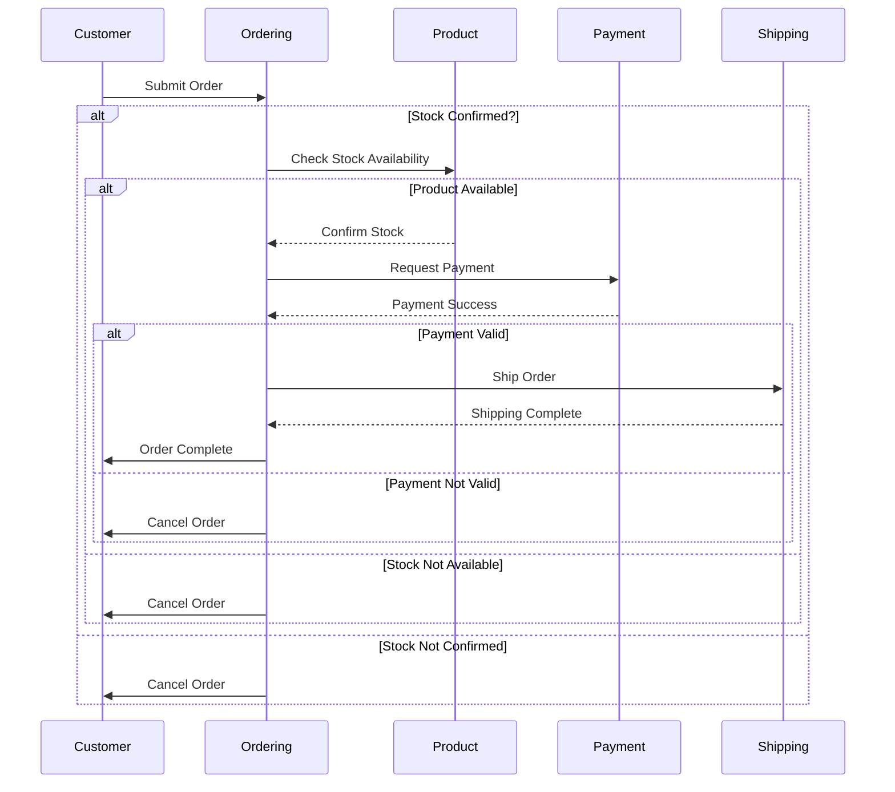
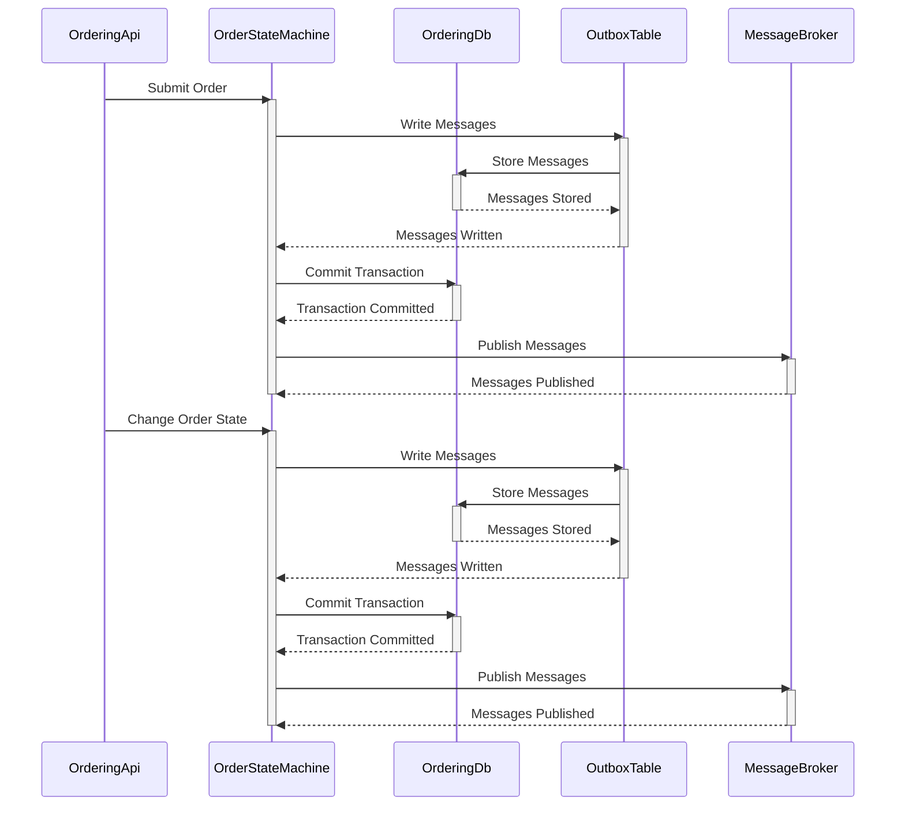
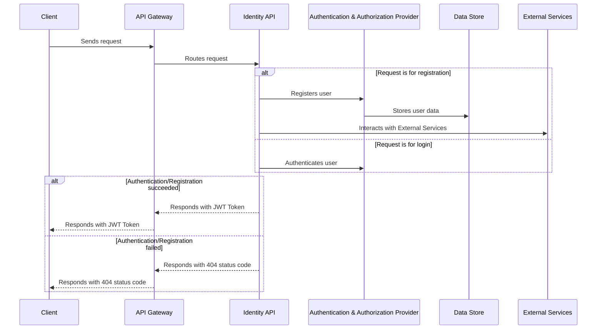
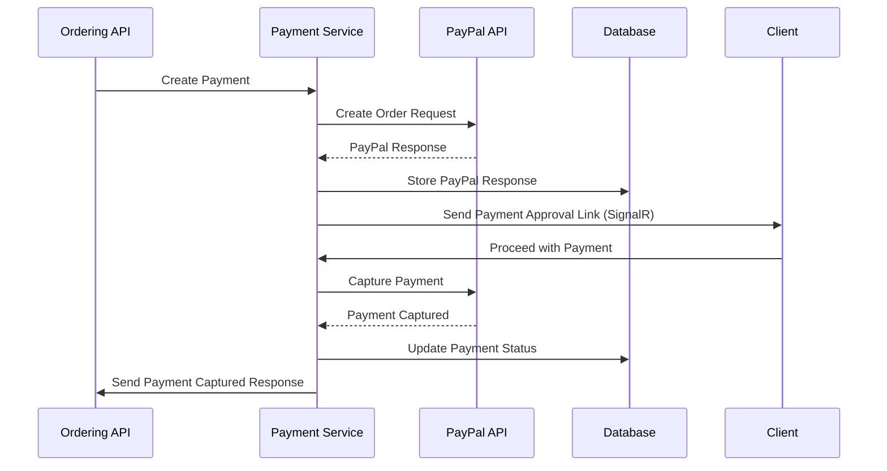

# CoffeeSpace [](https://codecov.io/gh/Marsik424/CoffeeSpace) [](https://github.com/Marsik424/CoffeeSpace/actions/workflows/build.yml)


# MAUI Client

Welcome to the MAUI Client! This client application is designed to provide a seamless and user-friendly experience for interacting with the MAUI (Mobile App for Unified Interaction) system. Below, you'll find information on key functionalities, including authentication, order creation, order payment, and order status tracking.

## Authentication

The MAUI Client offers a secure authentication system to ensure the privacy and security of your account. To get started, click on the **Login** button to access the MAUI features. If you are a new user, you can register by clicking on the **Register** button and providing the necessary information, including your username, email, and password.

## Order Management
Firstly, add order items from home page clicking `Add To Cart` button. Proceed to `Cart` page, confirm your order items, set delivery address and press `Place An Order`.


Keep track of your orders and proceed to payment in the **Order** section.
| State | Description |
| :---: | :---:|
| `Submitted`| Initial State Of Order|
| `StockConfirmed`| `Product API` Confirmed Order's Stock|
| `Paid`| `Payment Service` Captured Payment Response|
| `Shipped`|`Shipment Service` Registered Order |

It must be noted, that order will not proceed to `Paid` state, if user will not pay. After order's state will be changed to `StockConfirmed`, order should receive payment confirmation link from `Payment Service`. Then user can proceed to payment from `Order` page.


## API Overview 


|      API       |    Libraries     |   Services     |
| :------------: |  :-----------:   |  :-----------: |    
|  OrderingAPI   |       Core       | PaymentService |
|  ProductsAPI   |     Messages     | ShipmentService|
|  IdentityAPI   |      Domain      |


**To create messaging through MassTransit, all message models were moved to the Coffeespace.Messages project.**

Lets start with services, that some microservices can use. 

Service registration is implemented using the [Scrutor](https://github.com/khellang/Scrutor) library, which gives a great opportunity to add your services using reflection, as shown below.

```cs
 public static IServiceCollection AddApplicationService<TInterface>(
        this IServiceCollection services,
        ServiceLifetime serviceLifetime = ServiceLifetime.Scoped)
    {
        services.Scan(scan => scan
            .FromAssemblyOf<TInterface>()
            .AddClasses(classes =>
            {
                classes.AssignableTo<TInterface>()
                    .WithoutAttribute<Decorator>();
            })
            .AsImplementedInterfaces()
            .WithLifetime(serviceLifetime));

        return services;
    }
```
Basically, when an interface is parsed to a parameter, it scans all classes from its assembly and implements each of the derived classes as an implementation.
```cs
builder.Services.AddApplicationService(typeof(ICacheService<>));

builder.Services.AddApplicationService<IOrderService>();
``` 

**`ICacheService` is coming from the Coffeespace.Core class library. There are generic services and settings, which can be used across microservices.**

Caching is implemented in `Ordering API` and `Product API` using `Proxy` pattern. `Ordering API` uses [Mediator's](https://github.com/martinothamar/Mediator) notifications to move cache invalidation logic into `Notification Handler`.

After each of the process mutation process, I implicitly publish message to invalidate cache.

```cs
public Task<IEnumerable<Order>> GetAllByBuyerIdAsync(Guid buyerId, CancellationToken cancellationToken)
    {
        return _cacheService.GetAllOrCreateAsync(CacheKeys.Order.GetAll(buyerId.ToString()), () =>
        {
            var orders = _orderService.GetAllByBuyerIdAsync(buyerId, cancellationToken);
            return orders;
        }, cancellationToken);
    }
   public async Task<bool> CreateAsync(Order order, CancellationToken cancellationToken)
    {
        bool isCreated = await _orderService.CreateAsync(order, cancellationToken);
        if (isCreated)
        {
            await _publisher.Publish(new CreateOrderNotification
            {
                Id = order.Id,
                BuyerId = order.BuyerId
            }, cancellationToken).ConfigureAwait(false);
        }
        
        return isCreated;
    }
```

> Example is from [Cached Order Service](https://github.com/Marsik424/CoffeeSpace/blob/wip/CoffeeSpace.OrderingApi/Application/Services/Decorators/CachedOrderService.cs).


While `Product API` using different approach. Instead of moving cache invalidation logic to a different file, it invalidates 'on-place'.
```cs
 public Task<IEnumerable<Product>> GetAllProductsAsync(CancellationToken cancellationToken)
    {
        return _cacheService.GetAllOrCreateAsync(CacheKeys.Products.GetAll, () =>
        {
            var products = _productRepository.GetAllProductsAsync(cancellationToken);
            return products;
        }, cancellationToken);
    }

    public async Task<bool> CreateProductAsync(Product product, CancellationToken cancellationToken)
    {
        bool created = await _productRepository.CreateProductAsync(product, cancellationToken);
        if (created)
        {
            await _cacheService.RemoveAsync(CacheKeys.Products.GetAll, cancellationToken);
        }

        return created;
    }
    
```

> Example is from [Cached Product Repository](https://github.com/Marsik424/CoffeeSpace/blob/wip/CoffeeSpace.ProductApi/Application/Repositories/CachedProductRepository.cs).


**[Decorator](https://github.com/Marsik424/CoffeeSpace/blob/wip/CoffeeSpace.Core/Attributes/Decorator.cs)** attribute, tells [Scrutor](https://github.com/khellang/Scrutor) to not register classes who applied this attribute. In this application I've been using this attribute to implement `Proxy` pattern.  


## API's
### Ordering API

This API works as a command center for all messages related to creating, updating, scheduling and deleting orders. It publishes events to a message provider, that can then be consumed by other microservices. 

Here is the workflow of the `Ordering API` after an order is submitted.


As you can see, the `Ordering API` **can both publish and consume messages from other microservices. It uses the Masstransit StateMachine, which provides great opportunities to manage order state. There are five states: `Submitted`, `StockConfirmed`, `Paid`, `Shipped`, and `Canceled`.** When an order receives a new state, the [Order State Machine](https://github.com/Marsik424/CoffeeSpace/blob/wip/CoffeeSpace.OrderingApi/Application/Messaging/Masstransit/Sagas/OrderStateMachine.cs) changes its state in the database. The `Ordering API` has two databases: [Ordering DB](https://github.com/Marsik424/CoffeeSpace/blob/wip/CoffeeSpace.OrderingApi/Persistence/OrderingDbContext.cs) and [Order State DB](https://github.com/Marsik424/CoffeeSpace/blob/wip/CoffeeSpace.OrderingApi/Persistence/OrderStateSagaDbContext.cs). When an order is submitted, it is saved in the [Ordering DB](https://github.com/Marsik424/CoffeeSpace/blob/wip/CoffeeSpace.OrderingApi/Persistence/OrderingDbContext.cs), and then the [Order State Machine](https://github.com/Marsik424/CoffeeSpace/blob/wip/CoffeeSpace.OrderingApi/Application/Messaging/Masstransit/Sagas/OrderStateMachine.cs) sends all the necessary messages. The  [Order State Machine](https://github.com/Marsik424/CoffeeSpace/blob/wip/CoffeeSpace.OrderingApi/Application/Messaging/Masstransit/Sagas/OrderStateMachine.cs) uses the [Order State DB](https://github.com/Marsik424/CoffeeSpace/blob/wip/CoffeeSpace.OrderingApi/Persistence/OrderStateSagaDbContext.cs) as a storage for orders. **When an order reaches the Shipped or Canceled state, it is immediately removed from the database.** With this feature, the [Order State Machine](https://github.com/Marsik424/CoffeeSpace/blob/wip/CoffeeSpace.OrderingApi/Application/Messaging/Masstransit/Sagas/OrderStateMachine.cs) can easily continue to work with messages after it was stopped.

Furthermore, the `Ordering API` has one message for the `Identity API`. Basically,**when someone deletes a buyer, it sends a message to the `Identity API` to remove the buyer from its database. It also has a consumer that creates a new buyer if someone completes registration.**

In addition to its message publishing and consuming capabilities, the `Ordering API` also implements the transactional outbox pattern to ensure reliable message delivery. This pattern involves storing messages in a separate Outbox table within the [Ordering DB](https://github.com/Marsik424/CoffeeSpace/blob/wip/CoffeeSpace.OrderingApi/Persistence/OrderingDbContext.cs) database. When an order is submitted or its state changes, the [Order State Machine](https://github.com/Marsik424/CoffeeSpace/blob/wip/CoffeeSpace.OrderingApi/Application/Messaging/Masstransit/Sagas/OrderStateMachine.cs) writes the corresponding messages to the Outbox table within the same database transaction. This approach guarantees that the messages are persisted atomically with the database changes, ensuring transactional consistency.



> All requests have a timeout value. If a request exceeds this timeout value, it will automatically be moved into a canceled state.

### Product API

The `Product API` provides CRUD operations for managing products, and it is responsible for verifying the stock of orders.**If the order item's title is not found in the ProductApi database, the product cannot be fulfilled, and the order is moved to the cancel state.**


### Identity API

The `Identity API` allows users to log in or register as new users, using IdentityDbContext for authentication and identity storage purposes. 



**Once a user registers with the `Identity API`, it sends a message to the message provider, and the `Ordering API` acts as an external service and receives the message. This process results in the creation of a buyer after registration.**
## Services

### Payment Service
This service is designed to seamlessly handle the payment processing for orders received from an ordering API. It integrates with the PayPal API to facilitate secure and efficient transactions.


In order to create request more readable, I've implemented `Builder` pattern for `OrderRequest`. 
With [PayPalOrderRequestBuilder](https://github.com/Marsik424/CoffeeSpace/blob/wip/CoffeeSpace.PaymentService/Extensions/PayPalOrderRequestBuilder.cs) order creation process can be simplified using [Payment Constants](https://github.com/Marsik424/CoffeeSpace/blob/wip/CoffeeSpace.PaymentService/Helpers/PaymentConstants.cs).

### Shipment Service

The `Shipment Service` is a simple service that returns a successful result. However, in a real-world scenario, it would redirect to an external shipment service to handle the actual shipment.

## Log & Trace

Logging and tracing is an essential of all Web API's, Therefore, I added [Datadog](https://www.datadoghq.com/) support for all microservices. Providing `DD_API_KEY` to microservice, it will automaticlly send logs to datadog instance.
> Log is sent by [Serilog](https://serilog.net/).

In order to add tracing, I've added additional env variables for DD instance. `DD_LOGS_INJECTION`, `DD_APPSEC_ENABLED`, `DD_RUNTIME_METRICS_ENABLED`, all of the provided env 
variables is *optional* and not required for proper work of `Coffee Space`, except of `DD_API_KEY`.


## Environment Variables
In order to run this project, you need to configure the following environment variables in your secrets:

* **`AZURE_CLIENT_ID`**: The client ID of your Azure application.
* **`AZURE_CLIENT_SECRET`**: The client secret of your Azure application.
* **`AZURE_TENANT_ID`**: The ID of your Azure tenant.
* **`AZURE_VAULT_NAME`**: The name of your Azure Key Vault.
* **`DD_API_KEY`**: Datadog API key.

These environment variables are necessary for authentication and accessing the Azure Key Vault in the project. Make sure to set the values of these variables appropriately in your secret management system or environment configuration.

## Configure for local running
To configure each of the microservices manually for local running, follow these steps:

1. Clone Git repo
```bash
git clone https://github.com/Marsik424/CoffeeSpace.git
```
2. Set up the required environment variables by creating a .env file or utilizing Kubernetes secrets. Refer to the "Environment Variables" section for more information on the specific variables needed.

## Running in K8s

To run the microservices in K8s, follow these steps:

1. Proceed to section above to download and configure project env.

2. Start the deployment of the microservices to Kubernetes by running the following command:

```sh
kubectl apply -R -f ./deploy
```

5. To delete all pods, execute the following command in your terminal:

```sh
kubectl delete -R -f ./deploy
```

**All requests should be made to the API Gateway, which will eventually redirect them to the appropriate controller.**

## Postman Configuration

You will find the Postman collection file named ["CoffeeSpace.postman_collection" ](https://github.com/Marsik424/CoffeeSpace/blob/wip/CoffeeSpace.postman_collection.json)in the root of the project. This file contains the collection of API endpoints and associated requests that can be imported into Postman for testing and interacting with the project's APIs.

To import the Postman collection:

1. Launch Postman.
2. Click on the "Import" button located in the top-left corner.
3. Select the option to "Import File" and choose the ["CoffeeSpace.postman_collection"](https://github.com/Marsik424/CoffeeSpace/blob/wip/CoffeeSpace.postman_collection.json) file from the project's root directory.
4. Postman will import the collection, and you will be able to see the available requests and their associated details.

After importing the collection, you can explore the endpoints, customize the request parameters, and execute the requests against the project's APIs directly from Postman. This allows you to easily test and interact with the functionality provided by the project.

## Contributing

Contributions to CoffeeSpace project are always welcome! If you have any ideas, suggestions or improvements in mind, I would be more than happy to have them! You can start contributing by forking the repository, making your changes and submitting a pull request.

Some areas where you can contribute to are:

* Improving the existing microservices
* Adding new microservices
* Implementing new features
* Refactoring the code
* Improving the documentation
* Adding client support
* Datadog configuration

**Please make sure to follow the code style and the existing patterns in the project.** If you're not sure about something, feel free to create an issue and ask for help.

Also, I recommend discussing your ideas and changes by creating an issue, so I can make sure that your work is in line with the project's goals and direction.

## Related

I was inspired by this project

[eshopOnContainers](https://github.com/dotnet-architecture/eShopOnContainers)
