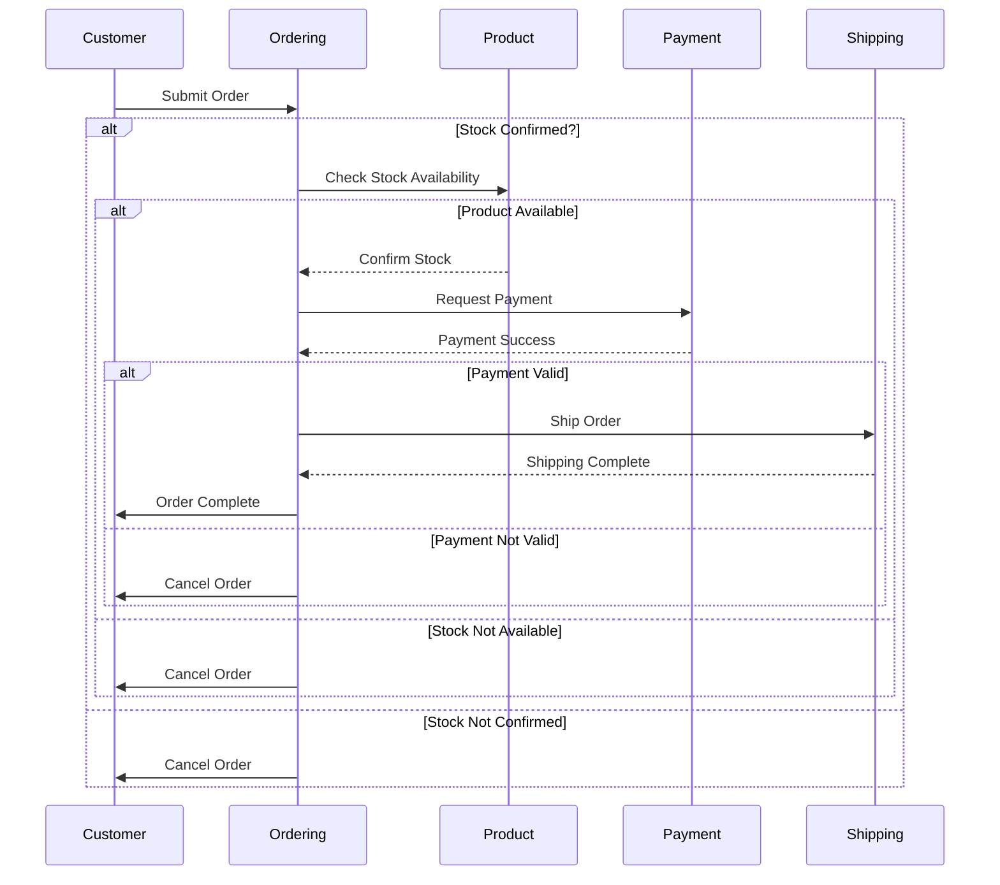
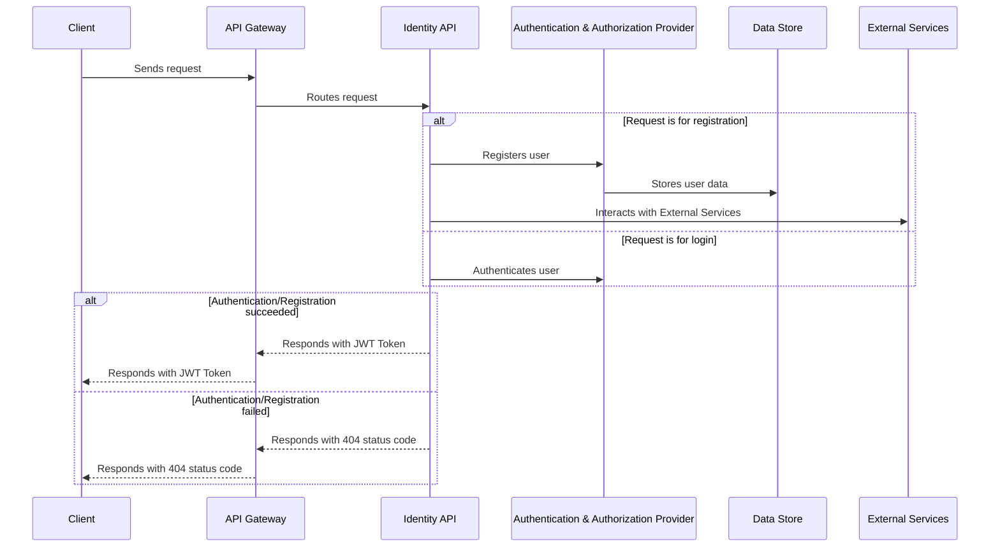
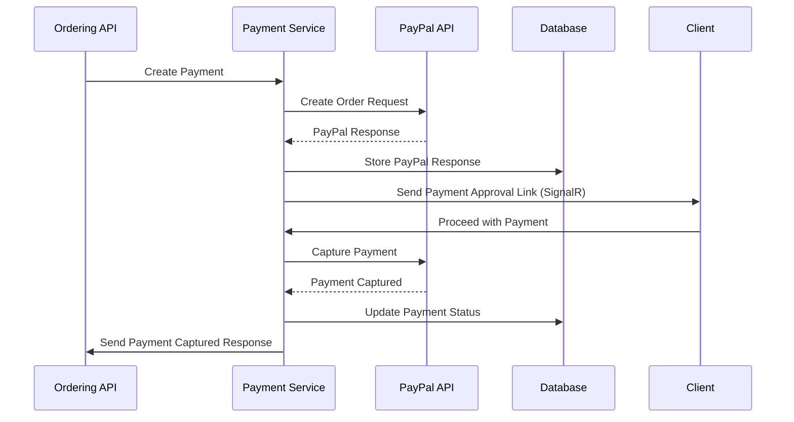

# CoffeeSpace [](https://codecov.io/gh/Marsik424/CoffeeSpace) [](https://github.com/Marsik424/CoffeeSpace/actions/workflows/build.yml)


# Client

Current version of CoffeeSpace uses [Avalonia](https://github.com/AvaloniaUI/Avalonia) UI framework and was tested on `MacOS` and `Windows`. However, older versions have been using [MAUI](https://github.com/dotnet/maui) as the main framework. 

## Order Management & Authentication
In order to start use client you must start the API. After that start the client and register or login into an account. 


Now, you should be able to create you first orders.


> Be sure to provide correct address, otherwise you will get an error.


# API 


|      API       |    Libraries     |   Services     |
| :------------: |  :-----------:   |  :-----------: |    
|  OrderingAPI   |       Shared       | PaymentService |
|  ProductsAPI   |     Messages     | ShipmentService|
|  IdentityAPI   |      Domain      |


| Order State | Description |
| :---: | :---:|
| `Submitted`| Initial State Of Order|
| `StockConfirmed`| `Product API` Confirmed Order's Stock|
| `Paid`| `Payment Service` Captured Payment Response|
| `Shipped`|`Shipment Service` Completed |

**To create messaging through MassTransit, all message models were moved to the Coffeespace.Messages project.**

Lets start with services, that some microservices can use. 

Service registration is implemented using the [Scrutor](https://github.com/khellang/Scrutor) library, which gives a great opportunity to add your services using reflection, as shown below.

```cs
 public static IServiceCollection AddApplicationService<TInterface>(
        this IServiceCollection services,
        ServiceLifetime serviceLifetime = ServiceLifetime.Scoped)
    {
        services.Scan(scan => scan
            .FromAssemblyOf<TInterface>()
            .AddClasses(classes =>
            {
                classes.AssignableTo<TInterface>()
                    .WithoutAttribute<Decorator>();
            })
            .AsImplementedInterfaces()
            .WithLifetime(serviceLifetime));

        return services;
    }
```
Basically, when an interface is parsed to a parameter, it scans all classes from its assembly and implements each of the derived classes as an implementation.
```cs
builder.Services.AddApplicationService(typeof(ICacheService<>));

builder.Services.AddApplicationService<IOrderService>();
``` 

**`ICacheService` is coming from the `Shared` library. There are generic services and settings, which can be used across microservices.**

Currently, there is two approaches on cache invalidation. `Ordering API` uses[Mediator's](https://github.com/martinothamar/Mediator) notifications to move cache invalidation logic into `Notification Handler`.

```cs
public Task<IEnumerable<Order>> GetAllByBuyerIdAsync(Guid buyerId, CancellationToken cancellationToken)
    {
        return _cacheService.GetAllOrCreateAsync(CacheKeys.Order.GetAll(buyerId.ToString()), () =>
        {
            var orders = _orderService.GetAllByBuyerIdAsync(buyerId, cancellationToken);
            return orders;
        }, cancellationToken);
    }
   public async Task<bool> CreateAsync(Order order, CancellationToken cancellationToken)
    {
        bool isCreated = await _orderService.CreateAsync(order, cancellationToken);
        if (isCreated)
        {
            await _publisher.Publish(new CreateOrderNotification
            {
                Id = order.Id,
                BuyerId = order.BuyerId
            }, cancellationToken).ConfigureAwait(false);
        }
        
        return isCreated;
    }
```

> Example is from [Cached Order Service](https://github.com/Marsik424/CoffeeSpace/blob/wip/CoffeeSpace.OrderingApi/Application/Services/Decorators/CachedOrderService.cs).


While `Product API` using different approach. Instead of moving cache invalidation logic to a different file, it invalidates 'on-place'.
```cs
 public Task<IEnumerable<Product>> GetAllProductsAsync(CancellationToken cancellationToken)
    {
        return _cacheService.GetAllOrCreateAsync(CacheKeys.Products.GetAll, () =>
        {
            var products = _productRepository.GetAllProductsAsync(cancellationToken);
            return products;
        }, cancellationToken);
    }

    public async Task<bool> CreateProductAsync(Product product, CancellationToken cancellationToken)
    {
        bool created = await _productRepository.CreateProductAsync(product, cancellationToken);
        if (created)
        {
            await _cacheService.RemoveAsync(CacheKeys.Products.GetAll, cancellationToken);
        }

        return created;
    }
    
```

> Example is from [Cached Product Repository](https://github.com/Marsik424/CoffeeSpace/blob/wip/CoffeeSpace.ProductApi/Application/Repositories/CachedProductRepository.cs).


## Ordering API

API that works as an orchestrator for all messages. Also, exposes API endpoints for order and buyer management.  

Here is the workflow of the `Ordering API` after an order is submitted.


The `Ordering API` **can both publish and consume messages from other microservices. It uses the Masstransit StateMachine, which provides great opportunities to manage order state. There are five states: `Submitted`, `StockConfirmed`, `Paid`, `Shipped`, and `Canceled`.** When an order receives a new state, the [Order State Machine](https://github.com/Marsik424/CoffeeSpace/blob/wip/CoffeeSpace.OrderingApi/Application/Messaging/Masstransit/Sagas/OrderStateMachine.cs) changes its state in the database. When an order is submitted, it is saved in the [Ordering DB](https://github.com/Marsik424/CoffeeSpace/blob/wip/CoffeeSpace.OrderingApi/Persistence/OrderingDbContext.cs), and then the [Order State Machine](https://github.com/Marsik424/CoffeeSpace/blob/wip/CoffeeSpace.OrderingApi/Application/Messaging/Masstransit/Sagas/OrderStateMachine.cs) sends all the necessary messages.

Furthermore, the `Ordering API` has one message for the `Identity API` **when someone deletes a buyer, it sends a message to the `Identity API` to remove the buyer from its database. It also has a consumer that creates a new buyer if someone completes registration.**


> All requests have a timeout value. If a request exceeds this timeout value, it will automatically be moved into a canceled state.

## Product API

The `Product API` provides CRUD operations for managing products, and it is responsible for verifying the stock of orders.**If the order item's title is not found in the ProductApi database, the product cannot be fulfilled, and the order is moved to the cancel state.**


## Identity API

The `Identity API` allows users to log in or register as new users, using `IdentityDbContext` for authentication and identity storage purposes. 



**Once a user registers with the `Identity API`, it sends a message to the message provider, and the `Ordering API` acts as an external service and receives the message. This process results in the creation of a buyer after registration.**
## Services

### Payment Service
This service is designed to seamlessly handle the payment processing for orders received from an ordering API. It integrates with the PayPal API to facilitate secure and efficient transactions.


In order to create request more readable, I've implemented `Builder` pattern for `OrderRequest`. 
With [PayPalOrderRequestBuilder](https://github.com/Marsik424/CoffeeSpace/blob/wip/CoffeeSpace.PaymentService/Extensions/PayPalOrderRequestBuilder.cs) order creation process can be simplified using [Payment Constants](https://github.com/Marsik424/CoffeeSpace/blob/wip/CoffeeSpace.PaymentService/Helpers/PaymentConstants.cs).

### Shipment Service

The `Shipment Service` is a simple service that returns a successful result. However, in a real-world scenario, it would redirect to an external shipment service to handle the actual shipment.

#### Log & Instrumentations
By default, all logs with open telemetry are being sent to the `Seq`. There is also `Prometheus` endpoint. 


#### Environment Variables
In order to run this project, you need to configure the following environment variables in your secrets:

* **`AZURE_CLIENT_ID`**: The client ID of Azure application.
* **`AZURE_CLIENT_SECRET`**: The client secret of Azure application.
* **`AZURE_TENANT_ID`**: The ID of Azure tenant.
* **`AZURE_VAULT_NAME`**: The name of Azure Key Vault.

These environment variables are necessary for authentication and accessing the Azure Key Vault in the project. Make sure to set the values of these variables appropriately in your secret management system or environment configuration.

## Configure for local running
To configure each of the microservices manually for local running, follow these steps:

1. Clone Git repo
```bash
git clone https://github.com/Marsik424/CoffeeSpace.git
```
2. Set up the required environment variables by creating a .env file or utilizing Kubernetes secrets. Refer to the "Environment Variables" section for more information on the specific variables needed.

## Running in K8s

To run the microservices in K8s, follow these steps:

1. Go to the root of the project and open terminal.

2. Create the deployment using `kubeclt` or `helm`

```sh
kubectl apply -R -f ./deploy/kubeclt
```
```
helm install CoffeeSpace ./deploy/helm/CoffeeSpace
```

3. To delete all pods, execute the following command in your terminal:

```sh
kubectl delete -R -f ./deploy/kubectl
```
```
helm uninstall CoffeeSpace
```

**All requests should be made to the API Gateway, which will eventually redirect them to the appropriate controller.**

## Postman Configuration

You will find the Postman collection file named ["CoffeeSpace.postman_collection" ](https://github.com/Marsik424/CoffeeSpace/blob/wip/CoffeeSpace.postman_collection.json)in the root of the project. This file contains the collection of API endpoints and associated requests that can be imported into Postman for testing and interacting with the project's APIs.

To import the Postman collection:

1. Launch Postman.
2. Click on the "Import" button located in the top-left corner.
3. Select the option to "Import File" and choose the ["CoffeeSpace.postman_collection"](https://github.com/Marsik424/CoffeeSpace/blob/wip/CoffeeSpace.postman_collection.json) file from the project's root directory.
4. Postman will import the collection, and you will be able to see the available requests and their associated details.

After importing the collection, you can explore the endpoints, customize the request parameters, and execute the requests against the project's APIs directly from Postman. This allows you to easily test and interact with the functionality provided by the project.

## Contributing

Contributions to CoffeeSpace project are always welcome! If you have any ideas, suggestions or improvements in mind, I would be more than happy to have them! You can start contributing by forking the repository, making your changes and submitting a pull request.

**Please make sure to follow the code style.**

## Related

I was inspired by this project

[eshopOnContainers](https://github.com/dotnet-architecture/eShopOnContainers)
